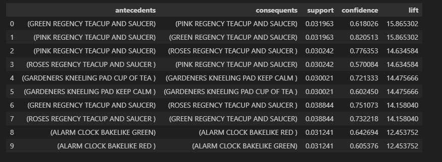
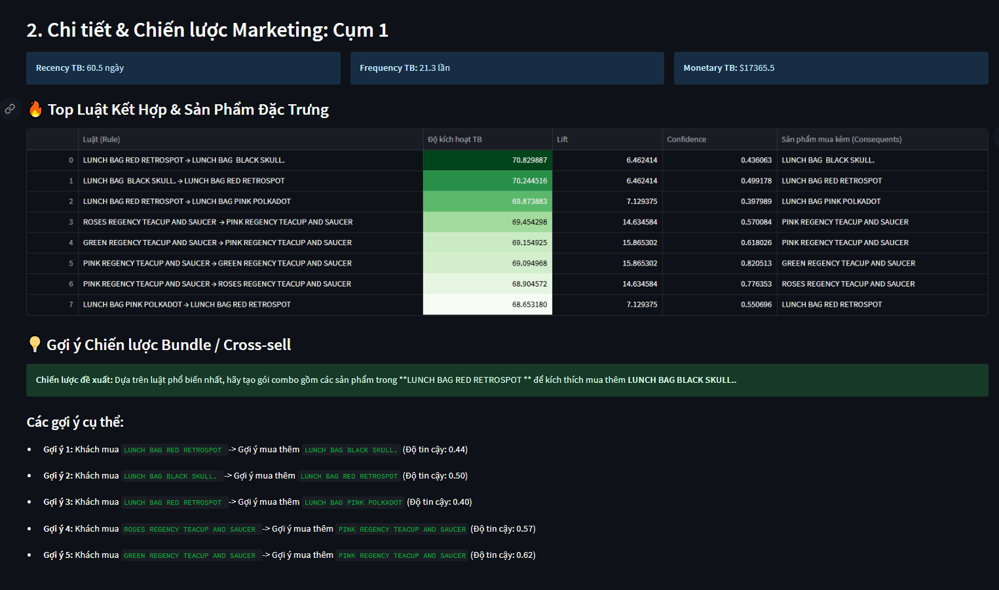

# Phân Tích Giỏ Hàng và Phân Cụm Khách Hàng

## Tổng Quan

Dự án này phân tích dữ liệu bán lẻ trực tuyến để khám phá mẫu mua sắm và phân cụm khách hàng sử dụng luật kết hợp (Association Rules).

## Cấu Trúc Dự Án

```
mini_project/
├── data/
│   ├── raw/online_retail.csv          # Dữ liệu gốc
│   └── processed/                     # Dữ liệu đã xử lý
├── notebooks/                         # Jupyter notebooks
│   ├── preprocessing_and_eda.ipynb    # EDA & tiền xử lý
│   ├── basket_preparation.ipynb       # Chuẩn bị giỏ hàng
│   ├── apriori_modelling.ipynb        # Thuật toán Apriori
│   ├── fp_growth_modelling.ipynb      # Thuật toán FP-Growth
│   ├── compare_apriori_fpgrowth.ipynb # So sánh thuật toán
│   └── clustering_from_rules.ipynb    # Phân cụm khách hàng
├── src/cluster_library.py             # Thư viện phân cụm
├── streamlib_app.py                   # Dashboard Streamlit
├── requirements.txt                   # Dependencies
└── README.md                          # Tài liệu này
```

## Cài Đặt

1. **Clone repository:**
   ```bash
   git clone <repository-url>
   cd mini_project
   ```

2. **Tạo môi trường:**
   ```bash
   conda create -n data310 python=3.10
   conda activate data310
   ```

3. **Cài đặt thư viện:**
   ```bash
   pip install -r requirements.txt
   ```

## Chạy Dự Án

### Thứ Tự Thực Hiện (Tập Trung FP-Growth):

1. **EDA & Tiền Xử Lý:**
   ```bash
   jupyter notebook notebooks/preprocessing_and_eda.ipynb
   ```
   - Input: `data/raw/online_retail.csv`
   - Output: `data/processed/cleaned_uk_data.csv`

2. **Chuẩn Bị Giỏ Hàng:**
   ```bash
   jupyter notebook notebooks/basket_preparation.ipynb
   ```
   - Chuyển đổi dữ liệu thành định dạng giỏ hàng
   - Tạo ma trận one-hot encoding

3. **Mô Hình FP-Growth:**
   ```bash
   jupyter notebook notebooks/fp_growth_modelling.ipynb
   ```
   - Khai thác luật kết hợp bằng FP-Growth
   - Tham số: min_support=0.01, min_confidence=0.2, min_lift=1.0
   - Output: `data/processed/rules_fpgrowth_filtered.csv`
   - giải thích việc chọn luật:
   - Nhóm sử dụng thuật toán FP-Growth do tốc độ nhanh hơn Apriori trên tập dữ liệu lớn.
      Ngưỡng min_support = 0.02 để loại bỏ các sản phẩm quá hiếm.
      Các luật được sắp xếp theo chỉ số lift nhằm ưu tiên các mối quan hệ có mức độ liên kết mạnh.
      Top 50 luật có lift cao nhất được chọn để cân bằng giữa chất lượng và số lượng.
      Trong report và dashboard, nhóm sử dụng 10 luật tiêu biểu nhất để minh họa.
     
     ## 🖥️ Bảng top 10 luật tiêu biểu
     

4. **Phân Cụm Khách Hàng:**
   ```bash
   jupyter notebook notebooks/clustering_from_rules.ipynb
   ```
   - Sử dụng luật FP-Growth làm đặc trưng
   - K-Means clustering với K=2
   - Output: `data/processed/customer_clusters_from_rules.csv`

### Chạy Tự Động:
```bash
python run_papermill.py  # Chạy tất cả notebooks
```

### Dashboard:
```bash
streamlit run streamlib_app.py
```
Truy cập `http://localhost:8501` để xem kết quả phân tích.

## 🖥️ Dashboard Phân tích & Phân cụm


## 🎯 Chi tiết & Chiến lược Marketing



## Kết Quả Chính

- **Luật Kết Hợp (FP-Growth):** Khám phá ~500 luật mạnh từ dữ liệu giao dịch
- **Hiệu Suất:** FP-Growth xử lý nhanh trên tập dữ liệu lớn (~541K giao dịch)
- **Phân Cụm:** 2 cụm khách hàng dựa trên luật kết hợp:
  - **Casual Shoppers (97%)**: Giá trị thấp, mua ít
  - **VIP Customers (3%)**: Giá trị cao, đóng góp 70% doanh thu

### Ví Dụ Luật FP-Growth:
```
Antecedents → Consequents | Support | Confidence | Lift
['JUMBO BAG RED RETROSPOT'] → ['JUMBO BAG PINK POLKADOT'] | 0.012 | 0.45 | 3.2
['ROSES REGENCY TEACUP AND SAUCER'] → ['PINK REGENCY TEACUP AND SAUCER'] | 0.015 | 0.52 | 2.8
```

## Thư Viện Chính

- `pandas`, `numpy` - Xử lý dữ liệu
- `mlxtend` - Luật kết hợp
- `scikit-learn` - Phân cụm
- `streamlit` - Dashboard
- `plotly` - Trực quan hóa

## Tác Giả


## License

None
